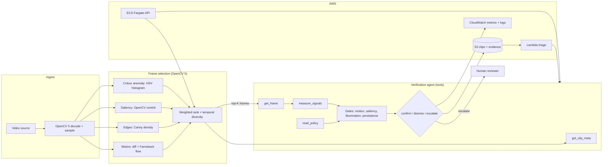
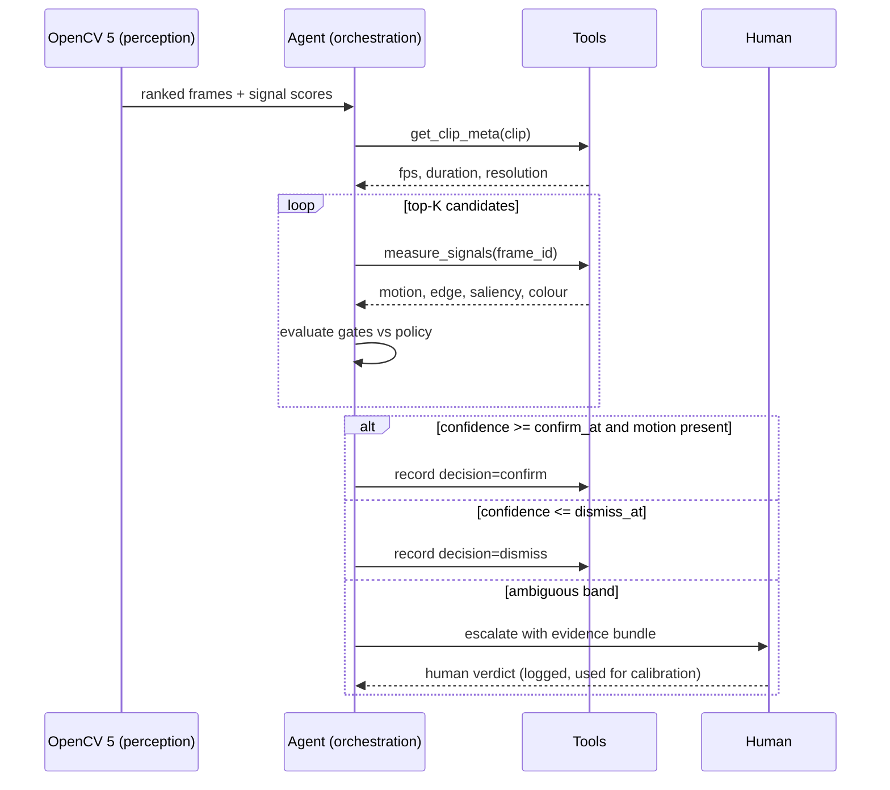

# Argus Architecture

## Component view

## Agent workflow (perception → decision → action)

## Why the split matters

The OpenCV 5 stage is the **safety floor**: it is deterministic, cheap, and cannot
hallucinate. The agent is the **flexible layer**: it can reason about policy and
edge cases, but it only ever sees the frames OpenCV chose and the signals OpenCV
measured. This keeps cost bounded (`n_frames ≫ selected_frames`) and keeps every
agent action traceable back to a numeric signal.

## Data flow and observability

- `var/uploads/` — staged uploads
- `var/decisions.jsonl` — one record per triage: decision, confidence, rule results,
  selected frames, cost, tool trace
- `var/runs.jsonl` — one record per batch/eval run
- AWS: same records to S3 (evidence) and CloudWatch (metrics)

## Failure handling

| Failure                   | Behaviour                                             |
| ------------------------- | ----------------------------------------------------- |
| Undecodable / empty clip  | `dismiss` with `decode_error` note, logged            |
| Dark / blown-out frames   | `illumination_usable` fails → confidence capped       |
| No motion at all          | cannot auto-confirm (hard rule) → `escalate`          |
| LLM backend unavailable   | fall back to deterministic heuristic reasoner         |
| Ambiguous evidence        | `escalate` to human, never guess                      |
