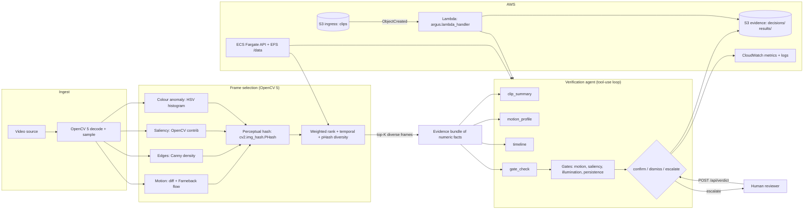
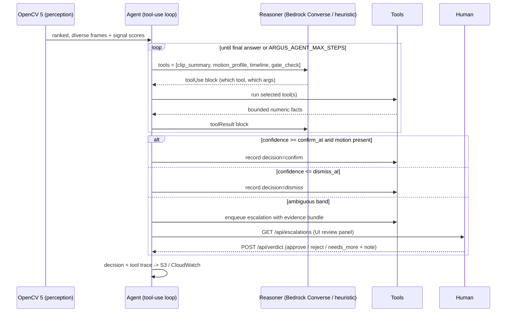

# Argus Architecture

## Component view

The agent's tools return **bounded numeric facts only** — there is no frame-fetching
tool and the model never receives raw pixels. `gate_check` is the only tool that sees
the policy gates, and its output is a deterministic function of the OpenCV signals.

## Agent workflow (perception → decision → action)

## Why the split matters

The OpenCV 5 stage is the **safety floor**: it is deterministic, cheap, and cannot
hallucinate. The agent is the **flexible layer**: it can reason about policy and
edge cases, but it only ever sees the frames OpenCV chose and the numeric signals
OpenCV measured. This keeps cost bounded (`n_frames ≫ selected_frames`) and keeps
every agent action traceable back to a numeric signal.

## Data flow and observability

- `var/uploads/` — staged uploads
- `var/decisions.jsonl` — one record per triage: decision, confidence, rule results,
  selected frames, cost, tool trace. `var/` is gitignored, so the judge-visible copy
  lives in `docs/evidence/decisions.jsonl`.
- `var/runs.jsonl` — one record per batch/eval run
- AWS: the `AwsSink` writes the same decision JSON to
  `s3://$ARGUS_S3_BUCKET/$ARGUS_S3_PREFIX` and publishes triage counts, latency and
  cost to CloudWatch under `ARGUS_CW_NAMESPACE`
- S3 **ingress** bucket → Lambda (`src/argus/lambda_handler.py`) triages a dropped clip
  and writes its decision into the S3 **evidence** bucket under `decisions/`. The
  evidence bucket carries no notification, so the trigger cannot loop.
- `var/escalations.jsonl` / `var/verdicts.jsonl` — the human-in-the-loop queue and
  every reviewer answer (`approve` / `reject` / `needs_more`); each verdict
  supersedes the open escalation for that `run_id`

## Failure handling

| Failure                   | Behaviour                                                        |
| ------------------------- | ---------------------------------------------------------------- |
| Undecodable / empty clip  | `escalate` with rationale `decode_error: ...` — never a 400, never a silent pass |
| Dark / blown-out frames   | `illumination_usable` fails → confidence capped, cannot confirm   |
| No motion at all          | cannot auto-confirm (hard rule) → `escalate`                      |
| Reasoner backend outage   | fall back to the deterministic heuristic reasoner; decision still produced, fallback recorded in the trace |
| Tool loop hits the budget | `ARGUS_AGENT_MAX_STEPS` (default 6) ends the loop; partial trace is kept |
| S3 / CloudWatch sink down | decision is already in the local log; the AWS write is retried and never blocks the decision |
| Ambiguous evidence        | `escalate` to human via the queue, never guess                    |

Human verdicts are real, not aspirational: `GET /api/escalations` lists the queue and
`POST /api/verdict` records the reviewer's answer, which is appended to the decision
log and usable to calibrate the `confirm` / `dismiss` thresholds.
